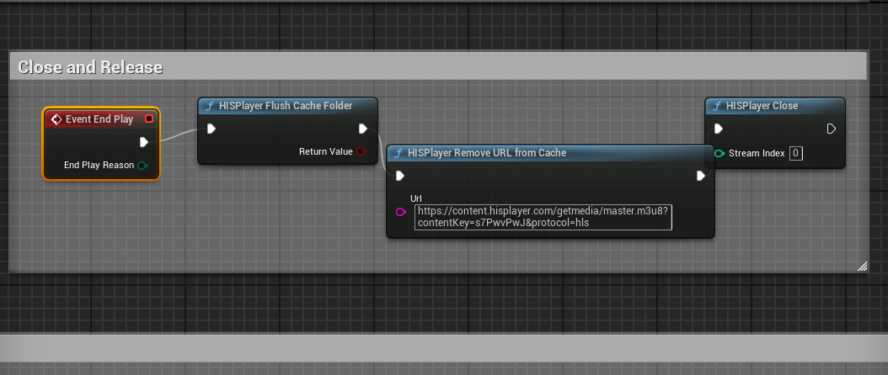

# Caching

HISPlayer Android for Unreal supports caching for HLS, DASH and Progressive Download(mp4) URLs to load the video faster from the cache.

### HISPlayer Types

* **public class HISPlayerEventCacheProgress**: The information of the CacheProgress event.
   * **public float requestLength**: The length of the content being cached in bytes.
   * **public float bytesCached**: The number of bytes that are cached.
   * **public float newBytesCached**: The number of bytes that have been newly cached since the last progress update.
 
* **public class UDelegateManager**: Use this delegate to receive the different HISPlayer cache events.
  * **OnCacheProgress**: This event occurs whenever there is a process of caching a certain URL. It shows the progress data of the current cache operation.
    * **Param1**: HISPlayerEventCacheProgress object with the status of the caching progress.
  * **OnCacheURLAdded**:  This event occurs whenever the current cache operation has finished of adding the URL to the cache.
    * **Param1**: Stream's url.
  * **OnCacheURLRemoved**: This event occurs whenever the current cache operation has finished of removing the URL from cache.
    * **Param1**: Stream's url.
  * **OnCacheFlushed**: This event occurs whenever the cache data has been flushed.

## Related APIs

#### static void InitCacheInstance (int maxCacheSize = 150 * 1024 * 1024l) // HISPlayer Init Cache Instance
Initialize the Cache Instance in order to use all the cache API. It can be called before or after HISPlayer Setup(). The maxCacheSize indicates the maximum permitted size by the cache in bytes. 150 MB will be set by default (150 * 1024 * 1024L bytes).

#### static void AddURLToCache(const FString& url) // HISPlayer Add URL to Cache
The cache must be initialized before using this function. Given the URL, a miminum amount of data will be stored in cache in order to initialize the video faster when it's needed. Once the video is loaded and played, it will continue caching the remaining fragments of the video. Live and Local video contents are not supported. In the case the cache folder is full, the least recently used old files will be removed when new data is downloaded following the Least Recently Used (LRU) cache policy.

#### static void RemoveURLFromCache(const FString& url) // HISPlayer Remove URL from Cache
The cache must be initialized before using this function. Removes the given URL from the cache if exists. Live and Local video contents are not supported. In the case the cache folder is full, the least recently used old files will be removed when new data is downloaded following the Least Recently Used (LRU) cache policy so it's possible the cached data from AddUrlToCache doesn't exist anymore.

#### static bool IsURLCached(const FString& url) // HISPlayer Is URL Cached
The cache must be initialized before using this function. Determines if the given URL is cached. In the case the cache folder is full, the least recently used old files will be removed when new data is downloaded following the Least Recently Used (LRU) cache policy so it's possible the cached data from AddUrlToCache doesn't exist anymore.
  
#### static int GetRemainingCacheSpace() // HISPlayer Get Remaining Cache Space
The cache must be initialized before using this function. Retrieves the remaining cache space in bytes.

#### static bool FlushCacheFolder() // HISPlayer Flush Cache Folder
The cache must be initialized before using this function. Free the cache folder. If a video was loaded from using the cache data, it will continue downloading the new fragments into the cache folder after the flushing is completed.

## How to use cache 

### Initialization
Initialize the Cache Instance in order to use all the cache API. It can be called before or after HISPlayer Setup(). The maxCacheSize indicates the maximum permitted size by the cache in bytes. 150 MB will be set by.

### Opening Cached Content
You can initialize the cache system instance just ater calling the HISPlayer Setup function. Then, add the URL of the stream manifest you want to add to the cache.

After the URL has been added to cache, the OnCacheURLAdded event will be thrown. There, you can call HISPlayer Open Player to open the cached content, using the same URL. You can use the functions *Is URL Cached*, *Get Remaining Cache Space* and *Flush Cache folder* as shown in the image below to keep control of the cached data.

### Cache Events
Use the delegate manager to bind different events and keep track of the cache loading status

### Release
Dont forget to flush the cache folder and remove the URL from cache before closing and releasing HISPlayer.

