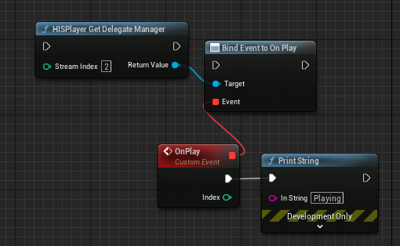

# HISPlayer API

## Public API
The following public APIs are provided by **HISPlayerManager**.

* **enum class HISPlayerStatus**: The different status in which the stream can be settled:
  * **NONE**
  * **CLOSE**: The stream is closed.
  * **STOP**: The content is stopped.
  * **PLAY**: The content is playing.
  * **PAUSE**: The content is paused.

* **struct FHISPlayerPlaybackProperties**: Use these properties to change the playback’s behavior from the editor.
  * **bool bAutoplay**: The content will automatically play after buffering is complete.
  * **bool bLooping**: The content will automatically loop after it ends.
  * **bool bMute**: The content audio will be muted.

* **public class UDelegateManager**: Use this delegate to receive the different HISPlayer events.
  * **OnLoading**: The content starts loading.
    * **Param1**: Stream's index.
  * **OnPlay**: The content starts playing.
    * **Param1**: Stream's index.
  * **OnPause**: The content pauses.
    * **Param1**: Stream's index.
  * **OnStop**: The content stops.
    * **Param1**: Stream's index.
  * **OnEndContent**: The content ends.
    * **Param1**: Stream's index.
  * **OnBuffering (float percentage)**: The content is buffering.
    * **Param1**: Stream's index. 
    * **Param2**: The current percentage of the buffering process.
  * **OnStatusChanged**: The HISPlayer Status has changed.
    * **Param1**: Stream's index. 
  * **OnTrackChanged**: The track of the stream has changed. 
    * **Param1**: Stream's index. 
  * **OnError**: The track of the stream has changed.
    * **Param1**: Stream's index. 

## Functions
Use the following UFunctions in your blueprint or script to make your custom HISPlayer implementation.

#### static void BeginPlay(int numStreams) // HISPlayer BeginPlay
Pre-initialize HISPlayer. You must call this function on BeginPlay before the SetUp.
  * **Param1**: The number of streams to instantiate.
 
#### static void Setup(int streamIndex, UTexture2D*& outputTexture) // HISPlayer Setup
Initialize HISPlayer. It creates a texture in runtime internally.
  * **Param1**: Stream index.
  * **Param2**: Result texture reference.
 
#### static void SetPlayBackProperties (int streamIndex, const FHISPlayerPlaybackProperties& Properties) // HISPlayer Set PlayBack Properties
Set the playback properties.
  * **Param1**: Stream index.
  * **Param2**: HISPlayer playback properties to set.

#### static FHISPlayerPlaybackProperties& GetPlaybackProperties(int streamIndex) // HISPlayer Set PlayBack Properties
Get the current playback properties.
  * **Param1**: Stream index.
  * **Return**: The actual stream's HISPlayer playback properties.
  
#### static int OpenPlayer(int streamIndex, const FString& url) // HISPlayer Open Player
Start HISPlayer. A valid URL must be passed as parameter.
  * **Param1**: Stream index.
  * **Return**: 0 on success.

#### static void Update(int streamIndex) // HISPlayer Update
Update each frame, needs to be called every frame.
  * **Param1**: Stream index.

#### static void Resume(int streamIndex) // HISPlayer Resume
Update each frame, needs to be called every frame.
  * **Param1**: Stream index.

#### static void Pause(int streamIndex) // HISPlayer Pause
Pause the video.
  * **Param1**: Stream index.

#### static void Stop(int streamIndex) // HISPlayer Stop
Stop the video and, next time it's played, it will begin from start.
  * **Param1**: Stream index.

#### static void Close(int streamIndex) // HISPlayer Close
Must be called for closing and releasing HISPlayer.
  * **Param1**: Stream index.

#### static void Seek(int streamIndex) // HISPlayer Seek
This method seeks the playback position exactly to a specific time.
  * **Param1**: Stream index.

#### static HISPlayerStatus GetPlayerStatus(int streamIndex) // HISPlayer Get Player Status
Get the current player status.
  * **Param1**: Stream index.
  * **Return**: Stream status as a HISPlayerStatus type.

#### static bool SetLooping(int streamIndex, bool looping) // HISPlayer Set Looping
Enable or disable looping.
  * **Param1**: Stream index.
  * **Param2**: Whether the looping should be enabled or disabled.
  * **Return**: True on success, False otherwise.

#### static bool SetMute(int streamIndex, bool mute) // HISPlayer Set Mute
Mute or Unmute audio playback.
  * **Param1**: Stream index.
  * **Param2**: True for muting, False for unmuting.
  * **Return**: True on success, False otherwise.

#### static void CreateNewTexture(int streamIndex, FIntPoint resolution, UTexture2D*& outputTexture) // HISPlayer Create New Texture
 Create a new texture of a new resolution for a particular stream.
  * **Param1**: Stream index.
	 * **Param2**: FIntPoint for resolution. X value for Width, Y value for Height.
	 * **Param3**: Result texture reference.

#### static int GetPlaybackPosition(int streamIndex) // HISPlayer Get Playback Position
 Get the current stream playback position in miliseconds.
  * **Param1**: Stream index.
  * **Return**: Playback position.
  
#### static UDelegateManager* Getdelegatemanager(int streamIndex) // HISPlayer Get Delegate Manager
Get the Delegate Manager.
  * **Param1**: Stream index.
  * **Return**: Delegate manager reference.
  
#### static FString GetExpirationDate(int streamIndex) // HISPlayer Get Expiration Date
Get the Expiration Date.
  * **Param1**: Stream index.
  * **Return**: Expiration date in String format.
