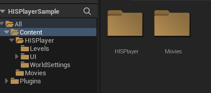
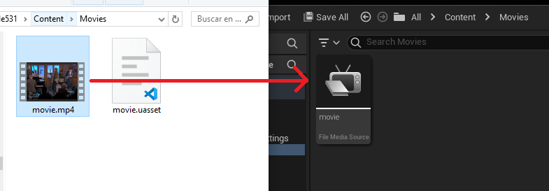
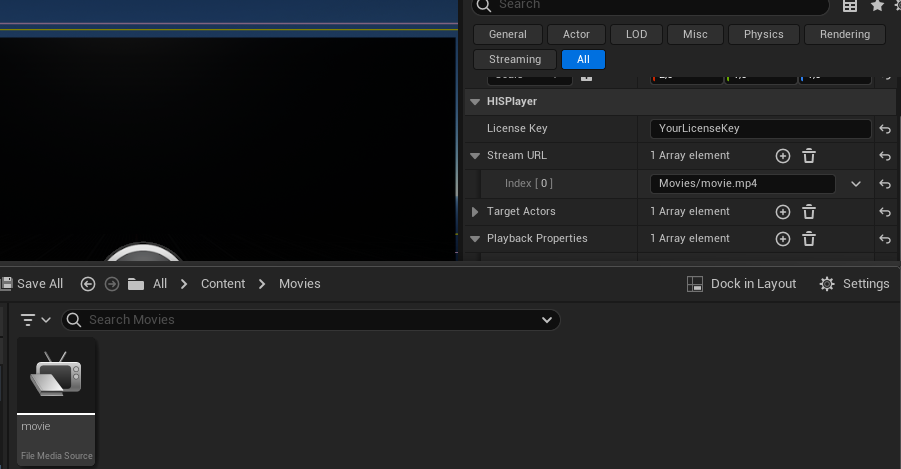
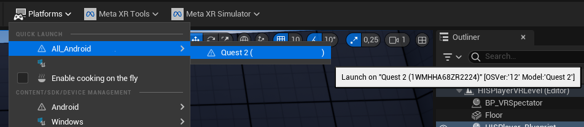
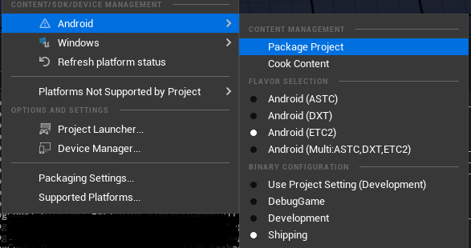
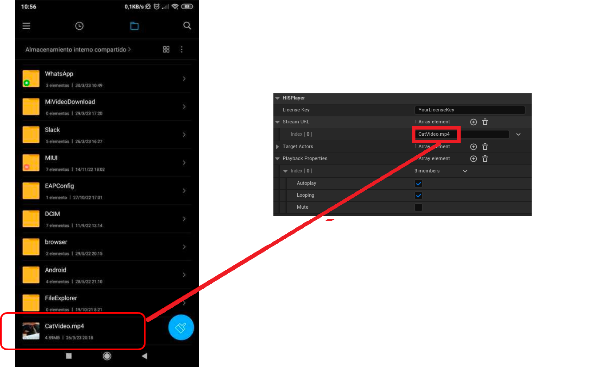

# Playing Local Files

HISPlayer Android for Unreal can play local content the device's storage. You can load the content from the **device's internal folders**, using the absolute path *(Ex: Downloads/movie.mp4)* or from the path relative to your **Content folder**, in case you have added the content into your project *(Ex: Movies/movie.mp4)*. This feature is available from HISPlayer Unreal SDK v2.8.0 and above.

## Project videos
In order to add local content to your Unreal project, create a diretory named *Movies* inside the main *Content* folder of your project.

Then, in your **Windows/Mac file explorer**, add your video into that folder. Then, drag and drop the content into the editor's *Movies* folder, to create the *movie.uasset* element. It's very important that the content exists on the *Content/Movies* folder of your project, otherwise it might not copy to the device (just the uasset might not be enough):  

Then, add your video's relative path to your **Content**'s folder. In this example, will be *Movies/movie.mp4*:

If you launch the project directly into your device, by going to **Platforms -> Quick Launch -> YourDeviceName**, the content of the **Movies** directory will be automatically copied into the Android device, enabling HISPlayer to find and reproduce the local file.

Otherwise, if you choose to package the project, save it in your **PC/Mac**, and then installing the APK manually into the device, this content will not be copied into the project, preventing **HISPlayer** from finding it.

## Device’s local videos
In order to add videos from the device, keep in mind the SDK is taking the root path of the phone storage. The next step is to pass the name (**with the extension**) to the Stream URL field.

In the case of exploring subfolders of the devices, it’s enough adding the subfolder at the beginning of the path, e.g., using a **WhatsApp video** it is possible to provide the following path: 

**WhatsApp/Media/WhatsApp Video/video.mp4**
&nbsp;
