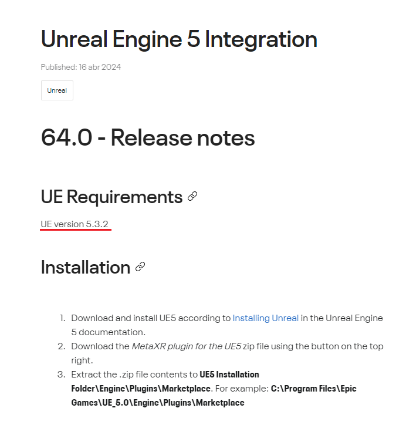
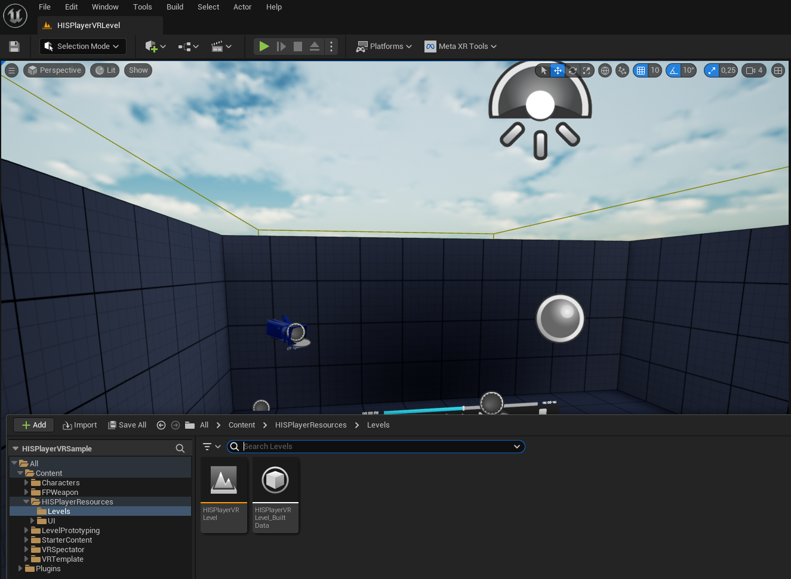
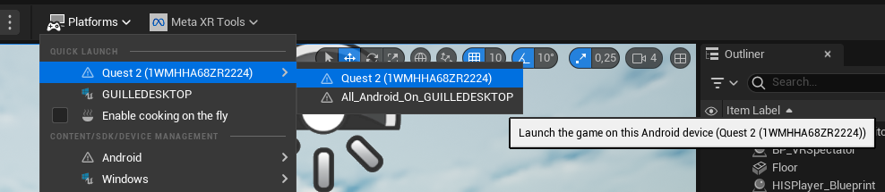

# Meta XR Plugin / Meta Quest Set Up Guide

## Requirements

#### Meta XR Plugin version
- Minimum Meta XR Plugin: 51.0
  
#### Unreal version
- Minimum Unreal version: 5.1

#### HISPlayer SDK version
- Minimum HISPlayer SDK version: 2.2.0 with Vulkan support.
  
#### Supported Android Version
- Minor version - Android 12
- Recommended SDK: 32
- Recommended NDK: 25.1.8937393
- Recommended JDK: JDK 11

## Install the Oculus PC app for Meta Quest Link app for Windows

Setup your Meta Quest device on your Windows system, by downloading the app for Meta Quest link. You can follow the [official guide](https://www.meta.com/help/quest/articles/headsets-and-accessories/oculus-rift-s/install-app-for-link/).

You may also use [Meta Quest Developer Hub](https://developer.oculus.com/documentation/unity/ts-odh/).

## Unreal 5 and Meta XR Plugin Integration

First, please configure your Unreal engine version for Meta Quest by installing the [Unreal 5 Meta XR Plugin](https://developer.oculus.com/downloads/package/unreal-engine-5-integration/64.0/) into your engine. Make sure that the version you are installing is the correct one for your UE version.

You can refer to any of the following guides for the Meta XR Plugin set-up for your project:
- [Creating Your First Meta Quest VR App in Unreal Engine](https://developer.oculus.com/documentation/unreal/unreal-quick-start-guide-quest/)
- [Unreal Engine 5.3.2 for Meta Quest VR Setup Guides](https://dev.epicgames.com/community/learning/tutorials/3Vx6/unreal-engine-5-3-2-for-meta-quest-vr) .

## HISPlayer VR Sample
### Download the Sample
Please, download the sample here: [**HISPlayer VR Sample**](https://downloads.hisplayer.com/Unreal/AllPlatforms/HISPlayerVRSample.zip) (no need to download it if you have received it in the email). 

### Import HISPlayer SDK
Please use HISPlayer SDK v2.2.0 and above with **Vulkan** support.

If you have not imported HISPlayer SDK yet, please follow the [Setup Guide](./setup-guide.md).
Extract the SDK from the .zip file, copy the **HISPlayer** folder and paste into the HISPlayerVRSample\Plugins directory.

The HISPlayer SDK plugin default UE version is 5.1. If you want to update it to a higher UE version, please do the following:
- Update the Plugins/HISPlayer/HISPlayer.uplugin file with the Engine Version you will be using. For more information, refer to the [setup guide](./setup-guide.md).

### Using the Sample
The HISPlayer VR Sample default UE version is 5.1. If you want to update it to a higher UE version, please do the following:
- Right click on the **HISPlayerVRSample.uproject** file, select the option "Switch Unreal Engine Version" and select your UE version.

Open **HISPlayerVRSample.uproject**. Once the project is opened, you should be inside the **HISPlayerVRLevel** map. 

  

To build for Meta Quest, you should configure your Android platform setting by following official guide from Meta: [Configure the Project for Meta Quest Development](https://developer.oculus.com/documentation/unreal/unreal-quick-start-guide-quest/#configure) or follow below steps:

- Go to Edit > Plugins and select the Virtual Reality section.
- Enable the Meta XR plugin.

  

- Choose restart editor on the prompt.
- Select the Meta XR tools button then Project Setup Tool to open the Project Setup Tool.

  

- Select Apply All for Required and Recommended Rules for all devices you are targeting.

  

- Restart the editor after applying settings. Note: This may require multiple restarts after applying a setting.

Input the license key that is associated with the SDK. If the license key is not valid, the player won’t work and will throw an error message. To find this field, go to the Level Outliner and look for the HISPlayer_Blueprint actor. Then, on the Details window, look for the HISPlayer section.

Then, package the project for the Android Platform, or deploy for your Quest device, in case it is connected to your PC through the Meta Quest Link App.

  

### Sample Description
The HISPlayer VR Sample is made based on the Unreal Engine [Virtual Reality Template](https://dev.epicgames.com/documentation/en-us/unreal-engine/vr-template-in-unreal-engine?application_version=5.3)

The important UI components are located in HISPlayerVRSample\Content\HISPlayerResources\UI:
- **HISPlayer_UI.uasset**: Widget Blueprint of the video playback control UI
- **HISPlayer_UI_Actor.uasset**: Blueprint class to place the **HISPlayer_UI** widget to VR space. The **HISPlayer_UI** is attached as a widget component.
- **HISPlayer_UI_OnClick.uasset**: Represents an abstract game action for **HISPlayer_UI** that can be mapped to Meta Quest left and right hand controllers 

  

The HISPlayer UI components are connected to the default VRTemplate's device input action mapping (IMC_Default) and Blueprint class (VRPawn) :
- HISPlayerVRSample\Content\VRTemplate\Input\IMC_Default.uasset: The **HISPlayer_UI_Onlick** is mapped in this input mapping context asset. It represents the Meta Quest left and right hand controllers input action for **HISPlayer_UI**.

  

- HISPlayerVRSample\Content\VRTemplate\Blueprints\VRPawn.uasset: a Pawn is the physical representation of the user and defines how the user interacts with the virtual world. In the VR Template, the Pawn contains the logic for input events from the motion controllers. You can also control the behavior of Meta Quest left and right hand controller through **WidgetInteractionLeft** and **WidgetInteractionRight**. The Blueprint also controls the UI interaction with the Meta Quest left and right hand controllers emulating the left-mouse click. 

  

