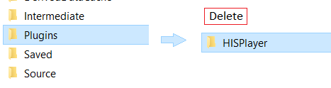
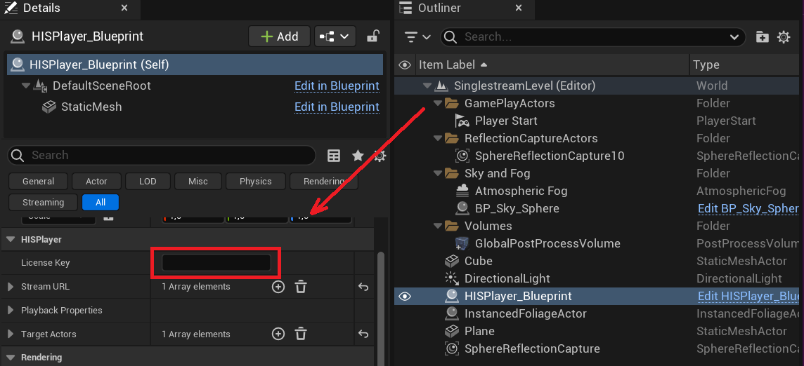

# Update the SDK

Through this guide, you will be introduced how to update the SDK if you already have installed the SDK previously.

- Go to your root project folder and delete the Binaries and Intermediate folders.
  

- Go to your root project folder > Plugins and delete the HISPlayer folder

- Paste your new HISPlayer SDK folder inside the Plugins folder.

- Go into the HISPlayer directory and check that the "Engine Version" field value in your **HISPlayer.uplugin** file is the same as your project’s Unreal version. If it's not, change the value. The "Engine Version" field will only take into account the major and middle version number (For example, if you are using UE 5.3.2, just add 5.3.0 to that field). Also make sure that "Android" is added to the PlatformAllowList field. 

- Execute Your_Project.uproject file.

- Update the license key that is associated with the SDK. If the license key is not valid, the player won’t work and will throw an error message. To find this field, go to the Level Outliner and look for the HISPlayer_Blueprint actor. Then, on the Details window, look for the HISPlayer section.

